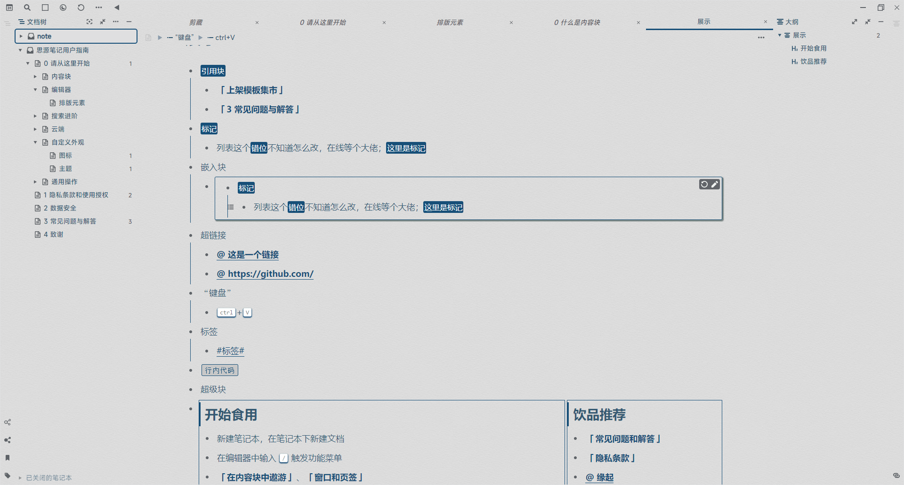
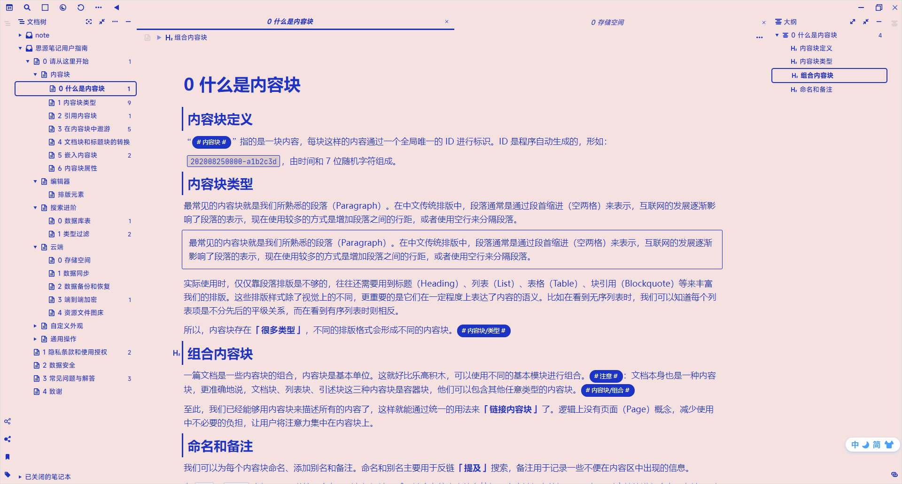
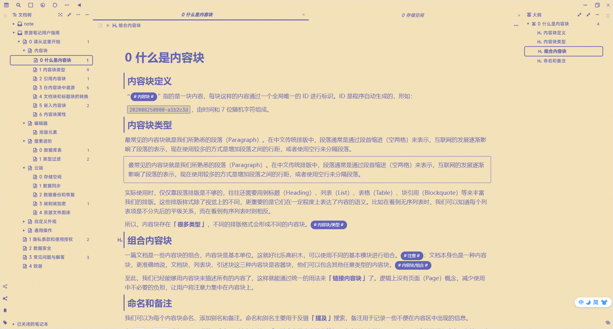
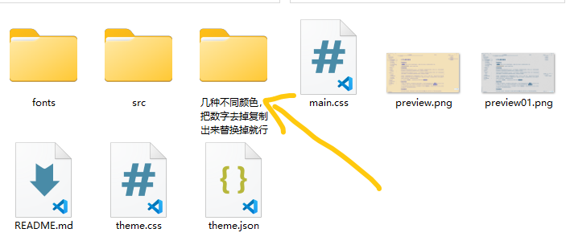

### paperX
* 一个极简风格的主题
* 因为我刚接触没几天，连选择器都找不着哈哈。借鉴了很多大佬的成果，非常感谢各位大佬！
* 更新日志：https://www.yuque.com/u1056440/uakg66/wn841g
***
### 预览：一共九种配色，完整预览在下面的语雀里
* 完整预览：https://www.yuque.com/u1056440/uakg66/irxvdg

* 更换颜色的方法：
*** 在预览中找到喜欢的颜色，在下面的文件夹里找到对应编号的css，复制出来替换掉theme.css就可以了。

### 建议图标
* notion-icon
* 把标题前面的emoji表情去掉更统一一点。
***
### 以下是借鉴过的大佬的主题 
主题：Tsundoku Green  
作者：Achuan-2  
GitHub：https://github.com/Achuan-2/siyuan-themes-tsundoku-green  
***
主题：Dark+  
作者：Zuoqiu-Yingyi  
GitHub：https://github.com/Zuoqiu-Yingyi/siyuan-theme-dark-plus  

